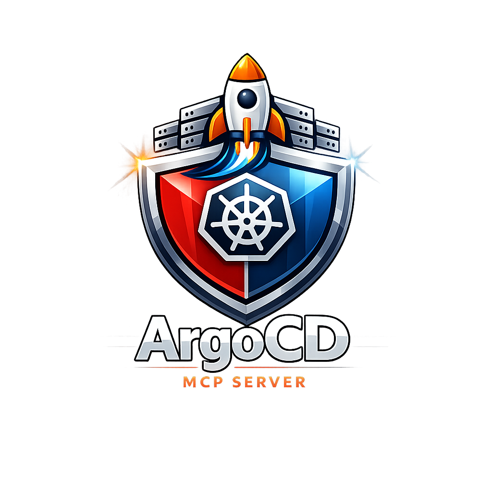

<p align="center">
  
</p>

<h1 align="center">ArgoCD MCP Server</h1>

<p align="center">
  <strong>Model Context Protocol server for Argo CD — GitOps continuous delivery for Kubernetes</strong>
</p>

<p align="center">
  
  = 18" />
  
  
</p>

---

Enable AI assistants (GitHub Copilot, Claude, Cursor) to interact with Argo CD — query application sync status, trigger syncs, manage rollbacks, view diffs, inspect resource trees, and more through natural language.

## Monorepo Structure

| Package | Description |
|---------|-------------|
| [`packages/argocd-mcp-server`](packages/argocd-mcp-server/) | Standalone MCP server (npm package + CLI) |
| [`packages/argocd-mcp-vscode-extension`](packages/argocd-mcp-vscode-extension/) | VS Code extension for automatic MCP registration |

## Quick Start

### Option 1: VS Code Extension (Recommended)

1. Install from Visual Studio Code [Marketplace](https://marketplace.visualstudio.com/publishers/bhayanak) 
2. Configure in VS Code Settings:
   - `argocd.url` — Your Argo CD server URL
   - `argocd.token` — API bearer token
3. The MCP server appears automatically in the Copilot Chat tool picker

### Option 2: Standalone server

```bash
npm install -g argocd-mcp-server
```

Set environment variables:

```bash
export ARGOCD_MCP_URL=https://argocd.example.com
export ARGOCD_MCP_TOKEN=your-api-token
```

### Option 3: VS Code `mcp.json`

```json
{
  "servers": {
    "argocd": {
      "type": "stdio",
      "command": "npx",
      "args": ["argocd-mcp-server"],
      "env": {
        "ARGOCD_MCP_URL": "https://argocd.example.com",
        "ARGOCD_MCP_TOKEN": "your-token"
      }
    }
  }
}
```

Note: Similar configuration for claude, curser and other AI tools.

## Tools (16)

| Tool | Description |
|------|-------------|
| `argocd_list_applications` | List all apps with sync/health status |
| `argocd_get_application` | Get detailed app info |
| `argocd_create_application` | Create a new application |
| `argocd_delete_application` | Delete an application |
| `argocd_sync_application` | Trigger sync (with dry-run support) |
| `argocd_refresh_application` | Refresh app state from cluster/Git |
| `argocd_get_app_diff` | View live vs desired diff |
| `argocd_list_revisions` | List deployment revision history |
| `argocd_rollback_application` | Rollback to a previous revision |
| `argocd_list_projects` | List AppProjects |
| `argocd_get_project` | Get project details |
| `argocd_list_repositories` | List configured repositories |
| `argocd_get_resource_tree` | Get managed resource tree |
| `argocd_get_resource` | Get specific resource manifest |
| `argocd_get_pod_logs` | Retrieve pod logs |
| `argocd_list_events` | List application events |

## Example Prompts

- *"List all ArgoCD applications that are out of sync"*
- *"Show me the health of the payment-service app"*
- *"Sync the web-frontend app with a dry run"*
- *"What changed in the last deployment of api-gateway?"*
- *"Rollback staging-app to revision 5"*
- *"Show me the pod logs for web-frontend"*


## License

[MIT](LICENSE)
